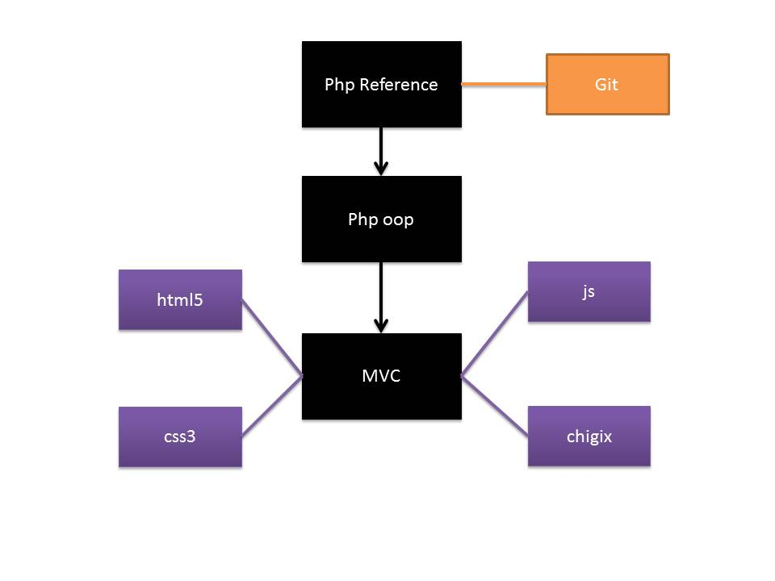
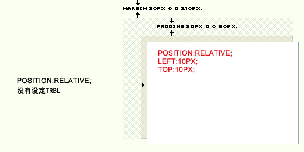

第二轮程序组培训计划
=====================================

# 五号任务培训进程

author：林永泽   
weibo：josephstalin  

本次项目教材托管于github  
address：[相关地址](http://github.com/josephstalin117/PHPTraining)  

## 培训目的

就目前时代的趋势而言，b/s端由于其得天独厚的轻客户端的优势，越来越赢得了开发者的亲睐，而在web开发语言中，php由于其入门简单，功能强大，已经成为了web开发的主流语言，全球40%的网站使用php作为其开发语言，其中不乏facebook，twitter等百万每秒访问量的庞大网站。而在中国也有巨大数量的网站使用php，社会上对php人才的需求越来越大，而我校由于历史的原因，缺乏对php的精通的人才，而社团作为其课上学习的补充，使用简单易懂的php语言进行教学无疑是合理与正确的。由此催生出五号任务。

## 培训结构

## 关于13年下学期的培训计划

### 概要

下学期将会有三期培训：

1. 大一新生培训计划（选择优良人才）
2. 大二web开发进阶培训（五号任务下）
3. 大一进阶培训（六号任务）

对于五号任务下，我们将继续专注于web开发，但其侧重点将侧重于前端开发，主要在于如下内容：

1. html5
2. css3
3. jquery
4. 与MVC框架的配合

其中五号任务下，在下学期作为重点培训目标。  

对于大一新生培训项目，其重点在于筛选人才，其社团提倡精英教育而非具有普世性，坚决剔除打酱油角色，同时杜绝阿猫阿狗参加培训的可能性。

其选出的人数将控制在6人以下，按照五号任务上的模式对其进行培训。

## 项目组的时间轴进度  

### 1.前端页面学习    

##### 学习html和css的基本概念和绝对定位相对定位  

超文本标记语言（英文：HyperText Markup Language，HTML）是为“网页创建和其它可在网页浏览器中看到的信息”设计的一种标记语言。HTML被用来结构化信息——例如标题、段落和列表等等，也可用来在一定程度上描述文档的外观和语义。1982年由蒂姆·伯纳斯-李创建，由IETF用简化的SGML（标准通用标记语言）语法进行进一步发展的HTML，后来成为国际标准，由万维网联盟（W3C）维护。  
HTML档案最常用的扩展名（扩展名）是.html，但是像DOS这样的旧操作系统限制扩展名为最多3个字符，所以.htm扩展名也允许使用。现在.htm扩展名使用的比较少一些了，但是仍旧受到支持。编者可以用任何文本编辑器或所见即所得的HTML编辑器来编辑HTML文件。  
早期的HTML语法规则定义较为松散，这有助于不熟悉网络出版的人采用。网页浏览器接受了这个事实，使之可以显示语法不严格的网页。随着时间的流逝，官方标准渐渐趋于严格的语法，但是浏览器继续显示一些远称不上合乎标准的HTML。使用XML的严格规则的XHTML（可扩展超文本标记语言）是W3C计划中的HTML的接替者。虽然很多人认为它已经成为当前的HTML标准，但是它实际上是一个独立的、和HTML平行发展的标准。W3C目前建议使用XHTML 1.1、XHTML 1.0或者HTML 4.01标准编写网页，但已有不少网页转用较新的 HTML5 编码撰写（如Google）。  

**HTML 的实际运行**  

HTML（网页）于电脑系统上的实际运行应用，大多数的人都以为网页是在线运行,可是HTML并不是实际的在线运行，下面的程序是HTML实际于电脑系统中的真实程序：

1. 用户于电脑中的网页浏览器输入网址（URL），该网址可以是互联网（Internet），也可以是内部网（Intranet）或是电脑本机的一个位置。  
2. 网页浏览器打开下载的网页文件，依据HTML内的描述找到该URI内的各项网络资源，然后依序将资源下载到本机电脑。
3. 网页浏览器依据 HTML 的描述，将已经下载下来的各种网络资源（如图形、文字）排列成HTML网页设计者当初建置该网页的样式。
4. 若是用者想要长期存储该网页及该网页的网络资源，可以利用浏览器提供的存储网页的功能来进行，该功能运行时，其实用户根本不需再次从网上下载任何数据，浏览器只是将原先存放于暂存区的网页及已经下载好的网络资源，转移至用户指定的长期存储区（可以是硬盘、光盘、或是闪存盘）。
5. 在网络上的网页只有一种格式，通常扩展名为 .html 或 .htm ，但是并不是只有这两种格式才是网页HTML，目前有许多动态网页或是交互网页其扩展名就不是.html或.htm，例如JAVA系统的.jsp微软系统的.asp等，其实这些文件他的内容与格式确实与HTML不同，可是这种动态网页，在浏览器阅读时，他们会自动产生纯正的HTML文文件给浏览器，所以浏览器阅读到的是经过服务器转换过的标准HTML，所以才能顺利展现HTML内所描述的样式。  

***

**HTML Headings**    

HTML headings are defined with the `<h1>` to `<h6>` tags.  

**HTML Paragraphs**

HTML paragraphs are defined with the `
` tag.  

**HTML Links**  

HTML links are defined with the `<a>` tag.  

Example  

`<a href="http://weibo.com/itasso">This is a link</a>`

**HTML Images**

HTML images are defined with the `` tag.

Example  

``

**HTML Comments**

Comments can be inserted into the HTML code to make it more readable and understandable. Comments are ignored by the browser and are not displayed.  

Comments are written like this:  

Example  

`<!-- This is a comment -->`  

**HTML Formatting Tags**  

HTML uses tags like `<b>` and `<i>` for formatting output, like bold or italic text.

These HTML tags are called formatting tags (look at the bottom of this page for a complete reference).  

**Styling HTML with CSS**  

CSS was introduced together with HTML 4, to provide a better way to style HTML elements.    

CSS can be added to HTML in the following ways:  

1. Inline - using the style attribute in HTML elements  
2. Internal - using the ``  
`</head>`

* *External Style Sheet*

An external style sheet is ideal when the style is applied to many pages. With an external style sheet, you can change the look of an entire Web site by changing one file. Each page must link to the style sheet using the `<link>` tag. The `<link>` tag goes inside the `<head>` section:  

`<head>`
`<link rel="stylesheet" type="text/css" href="mystyle.css">`
`</head>`

* *HTML Style Tags*

Tag	Description  

``  
`</head>`  
`<body>`  
  
`<h2>Nirvana</h2>`  
`Record: MTV Unplugged in New York`  
`Year: 1993`  
`<h2>Radiohead</h2>`  
`Record: OK Computer`  
`Year: 1997`  

`</body>`  
`</html>`  
  

* *绝对定位和相对定位*  

The CSS positioning properties allow you to position an element. It can also place an element behind another, and specify what should happen when an element's content is too big.

Elements can be positioned using the top, bottom, left, and right properties. However, these properties will not work unless the position property is set first. They also work differently depending on the positioning method.

There are four different positioning methods.

Absolute，CSS中的写法是：position:absolute  
他的意思是绝对定位，他是参照浏览器的左上角，配合TOP、RIGHT、BOTTOM、LEFT(下面简称TRBL)进行定位，在没有设定TRBL，默认依据父级的做标原始点为原始点。如果设定TRBL并且父级没有设定position属性，那么当前的absolute则以浏览器左上角为原始点进行定位，位置将由TRBL决定。将对象从文档流中拖出，使用left，right，top，bottom等属性相对于其最接近的一个最有定位设置的父对象进行绝对定位。如果不存在这样的父对象，则依据body对象。  

一般来讲，网页居中的话用Absolute就容易出错，因为网页一直是随着分辨率的大小自动适应的，而Absolute则会以浏览器的左上角为原始点，不会应为分辨率的变化而变化位置。很多人出错就在于这点上出错。而网页居左其特性与Relative很相似，但是还是有本质的区别的。  

Relative，CSS中的写法是：position:relative; 他的意思是相对定位，他是参照父级的原始点为原始点，无父级则以文本流的顺序在上一个元素的底部为原始点，配合TRBL进行定位，当父级内有padding等CSS属性时，当前级的原始点则参照父级内容区的原始点进行定位。  

relative常常于margin,float配合使用，而absolute常常用于top等。  

* *What is CSS Float?*

With CSS float, an element can be pushed to the left or right, allowing other elements to wrap around it.  

Float is very often used for images, but it is also useful when working with layouts.  

Elements are floated horizontally, this means that an element can only be floated left or right, not up or down.  

A floated element will move as far to the left or right as it can. Usually this means all the way to the left or right of the containing element.  

The elements after the floating element will flow around it.  

The elements before the floating element will not be affected.  

If an image is floated to the right, a following text flows around it, to the left:  

`img{`  
`float:right;`  
`}`  

center

`div{`
	`margin:auto;`
`}`

最后之作

***

##### photoshop速成  
##### markdown学习  

Markdown 是一种轻量级标记语言，创始人为约翰·格鲁伯（John Gruber）和亚伦·斯沃茨（Aaron Swartz）。它允许人们“使用易读易写的纯文本格式编写文档，然后转换成有效的XHTML(或者HTML)文档”。这种语言吸收了很多在电子邮件中已有的纯文本标记的特性。

* 段落  

一个段落是由一个或多个连续的行构成，段落间靠一个或以上视觉上的空行划分。一般的段落不应该用空格或制表符缩进。  

* 换行   

在文本中输入的换行会从最终生成的结果中删除，浏览器会根据可用空间自动换行。如果想强迫换行，可以在行尾插入至少两个空格。  

* 强调  

`*强调*` 或者 `_强调_`  (示例：*强调*)  
`**加重强调**` 或者 `__加重强调__` (示例：**强调**)  
`***特别强调***` 或者 `___特别强调___` (示例：***粗斜体***)  

* 代码  

要在Markdown中插入代码，你有两种选择。 一种是把代码用反引号(`)(键盘上Esc键下面的键)包起，例如：  

夹杂着`some code`的文字内容

* 列表  
 
 `*` 无序(没有编号的)列表中的一项  
 `*` 无序列表中的另一个项  
 `1.` 有序(排好序，有编号的)列表中的一项   

* 链接  

链接可以在行内插入：    
`[it俱乐部](http://weibo.com/itasso)`  
[it俱乐部](http://weibo.com/itasso)  

* 水平分割线  

要生成水平分割线，可以在单独一行里输入3个或以上的短横线、星号或者下划线实现。短横线和星号之间可以输入任意空格。以下每一行都产生一条水平分割线。  
`* * *`
`***`
`*****`
***

##### sublime  

Sublime Text is a sophisticated text editor for code, markup and prose.You'll love the slick user interface, extraordinary features and amazing performance.  

[下载地址](http://www.sublimetext.com/)

**page control**  

按键盘 Ctrl+~（数字1左边的按键）调出控制台，然后拷贝下面的代码进去并回车，它会自动帮你新建文件夹并下载文件

`import urllib2,os; pf='Package Control.sublime-package'; ipp=sublime.installed_packages_path(); os.makedirs(ipp) if not os.path.exists(ipp) else None; urllib2.install_opener(urllib2.build_opener(urllib2.ProxyHandler())); open(os.path.join(ipp,pf),'wb').write(urllib2.urlopen('http://sublime.wbond.net/'+pf.replace(' ','%20')).read()); print 'Please restart Sublime Text to finish installation'`

##### 静态登录设计  

##### 交流与点评    

### 2.JavaScript学习    

* JavaScript快速入门
* jQuery与OOP
* jQuery动画
* jQuery的DOM操作
* jQuery插件系统
* jQuery事件
* jQuery-UI插件
* AJAX动态交互
* Chrome/Webkit前端调试器

### 3.数据库设计与php

* 关系数据库的基本概念和Mysql的基本使用
* sql语句的创建表和数据库
* mysql的CURD操作
* 数据库的设计
* php与MySQL的交互
* COOKIE，SESSION操作
* PCRE模式 

### 4.ThinkPHP项目实战

* 前后端COOKIE，SESSION配合
* ThinkPHP网站速建
* ThinkPHP视图渲染
* ThinkPHP中的CURD操作
* ThinkPHP高阶查询
* ThinkPHP数据库应用逻辑
* ThinkPHP控制器设计
* ThinkPHP控制器实战
* ThinkPHP调试
* AJAX原理与简单实践
* AJAX前端高阶调试
* AJAX动态登录
* AJAX前后端交互
* ChromePHP调试类
* ThinkTemplate模板引擎
* ThinkPHP实战

### 7.CMS的使用和云计算

* wordpress博客系统
* cms内容管理系统
* 新浪云计算和百度云计算

### 8.网站的架设

* 完成自己的blog网站

