IT俱乐部项目培训材料
=============================================

- [PHP基础模块](#php)
    - [从SNS开始](#sns)
        - [什么是msysGit](#msysgit)
        - [安装msysGit](#msysgit-1)
        - [初始化配置](#)
        - [配置SSH密钥](#ssh)
    - [语法、常量、变量及数据类型详解](#-1)
        - [基本结构控制语句](#-2)
    - [运算符、流程控制](#-3)
    - [循环结构、系统函数和自定义函数](#-4)
    - [数组、多维数组和数组函数](#-5)
    - [字符串操作变换](#-6)
    - [文件操作函数](#-7)
- [PHP与OOP](#phpoop)
    - [面向对象的基本概念](#-8)
        - [OOP](#oop)
        - [ABSTRACTION](#abstraction)
        - [CLASS](#class)
        - [OBJECT](#object)
        - [Function(Method)](#functionmethod)
        - [Message Passing(also known as method calling)](#message-passingalso-known-as-method-calling)
        - [Property](#property)
        - [Inheritance(also known as subclasses)](#inheritancealso-known-as-subclasses)
        - [Encapsulation](#encapsulation)
        - [Polymorphism](#polymorphism)
    - [面向对象初始化this关键字](#this)
    - [初类的封装关键字](#-9)
        - [Visibility](#visibility)
        - [Static Keyword](#static-keyword)
        - [Scope Resolution Operator (::)](#scope-resolution-operator-)
    - [类的继承extends](#extends)
        - [Object Inheritance](#object-inheritance)
        - [Constructors and Destructors](#constructors-and-destructors)
    - [抽象类abstract](#abstract)
        - [Overloading](#overloading)
            - [Property overloading](#property-overloading)
    - [mysqli](#mysqli)
        - [The object-oriented interface](#the-object-oriented-interface)
            - [guest](#guest)
            - [mysqli](#mysqli-1)
    - [常用关键字](#-10)
    - [多态的介绍与优势](#-11)
    - [相关魔术方法](#-12)
- [ThinkPHP与千木服务架构](#thinkphp)
    - [MVC初学体验与服务器环境部署](#mvc)
        - [如何学习](#-13)
        - [MVC](#mvc-1)
    - [目录结构和命名](#-14)
    - [项目部署和常见参数](#-15)
    - [系统常量及URL模式](#url)
    - [开发规范](#-16)
    - [调试工具及空操作](#-17)
    - [HTML5快速入门](#html5)
    - [模板引擎](#-18)
    - [服务类拼装](#-19)
    - [表单设计与提交规范](#-20)

# PHP基础模块

## 从SNS开始

初学环境使用：Codepad.org + Notepad ++

### 什么是msysGit

msysGit是一个为Windows编译Git的开发环境。该软件是一个针对Git的完整解决方案，即无需再为Git问题安装第三方软件应用。

msysGit实质上只是一个为在Windows上安装配置Git环境的安装包。

网络上发行的可下载版本为：fullinstall（离线完整安装包）和netinstall（网络安装包）

msysGit项目编译自gcc（GNU C Compiler）。

于是乎，[下载](http://git-scm.com/downloads)对应版本安装即可。

### 安装msysGit

运行安装程序：

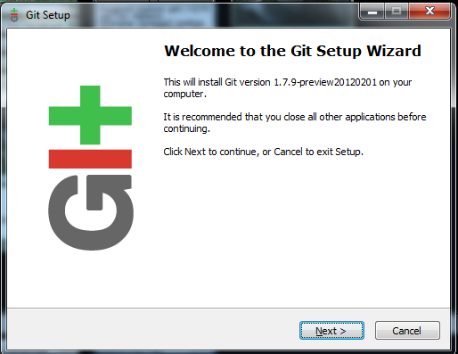

点击 `Next` 进入下一个界面，果断再点个 `Next` ，EULA的GNU协议界面没啥好看的。

接着Git Setup会提示输入程序安装的目标路径（此处对路径选择无要求），再点下一步，会跳出一个安装组件选择窗口：

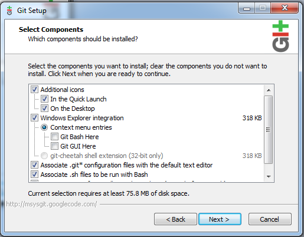

在此选择了“Git Bash Here”或是“Git GUI Here”，你的系统右键菜单都会新添加对应的菜单项。所以在此建议是全部安装。

然后狂点“Next”，直到出现下面这个环境变量设置画面：

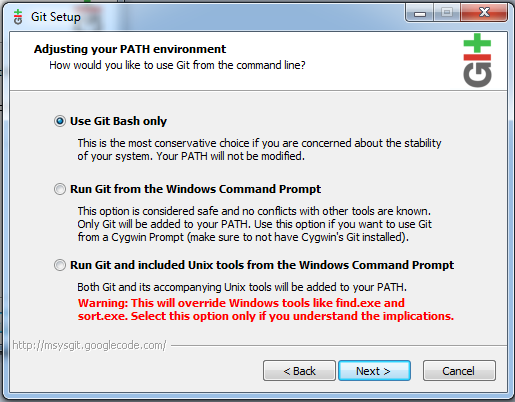

一般默认是选择第一个“Use Git Bash Only”。如果你还想写一些牛B的脚本来使用Git运行，那么可以选择第二个“Run Git from the Windows Command Prompt”。至于第三个“Run Git and included Unix tools from the Windows Command Prompt”是本次安装中不安装Cygwin，一般人都没配置和安装过Cygwin包，所以此项果断忽略。选择好后，点击“Next”。

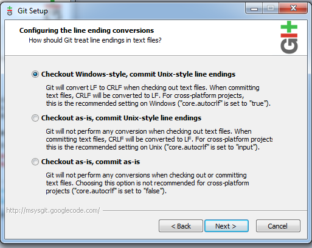

此画面中选择第一项“Checkout Windows-style,commit Unix-style line endings”，然后单击“Next”，最后点“Finish”退出安装。

分别使用Add, Mod(ify), Ref(actoring), Fix, Rem(ove) and Rea(dability) 来规范化commit message。

    Add: New function to rule the world.  
    Mod: Add women factor in Domination.ruleTheWorld().  
    Ref: Extract empathy stuff to an abstract class.  
    Fix: RUL-42 or #42 Starvation need to be initialised before Energy to avoid the nullpointer in People.  
    Rem: freeSpeech is not used anymore.  
    Rea: Removed old TODO and extra space in header.  

如果说内容变更项目有多条，则按重要性级别进行排列。

### 初始化配置

使用Git的第一件事就是设置你的**名字**和**Email**，这两个就是在提交commit时的签名信息。

    $ git config --global user.name "Scott Chacon"
    $ git config --global user.email "schacon@gmail.com"

执行了上面的命令后，会在主目录（home directory）建立一个叫.gitconfig的文件。其内容一般如下：

    [user]
            name = Scott Chacon
            email = schacon@gmail.com

linux中该文件在 `~/.gitconfig`，Windows中该文件在 `用户\UserName\.gitconfig` 。 

从该文件的存储位置可知，本文件中的设置是全局，直接影响到此用户建立的所有项目。

如果想要在当前项目中与全局设置有不一样的内容，可以通过上面的 `git config` 命令，不带 `--global` 选项地进行设置。此时会在当前项目的 `.git/config` 文件夹中增加对应的内容节。

如若要查看当前项目下的所有配置参数：

    $ git config -l
    core.symlinks=false
    core.autocrlf=true
    color.diff=auto
    color.status=auto
    color.branch=auto
    color.interactive=true
    pack.packsizelimit=2g
    help.format=html
    ...

***

### 配置SSH密钥

1.  确定.ssh目录

        $ cd ~/.ssh
        # 请务必首先确认目录.ssh的存在，Windows系统一般在用户个人目录下。

2.  生成一个新的SSH密钥

        ssh-keygen -t rsa  -N '' -f ~/.ssh/github.com_rsa;

3.  打开~/.ssh/config文件，在后面追加（在此以用户名chigix为例）：

        Host github.com
         User chigix
         IdentityFile ~/.ssh/github.com_rsa
         PreferredAuthentications publickey

4.  进入“[Account Settings](https://github.com/settings/profile)”↓   
    
    
    找到“SSH Keys”↓   
    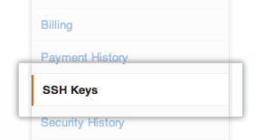
    
    点击“Add SSH key”↓    
    
    
    将本地计算机中~/.ssh/github.com_rsa.pub文件中的内容全部复制入Key中↓   
    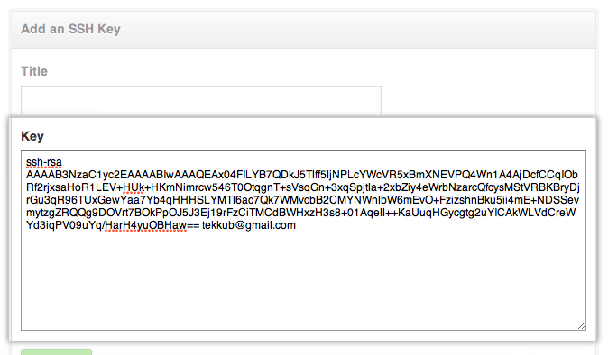
    在上图的“Title”框中写好标题，比如“笔记本”则代表此密钥对应你的小本。
    
    点击下面的“Add key”↓    
       
    提交后，会进入密码验证，输入自己账户的密码确认即可：    
    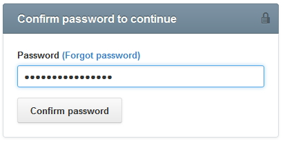

5.  确认上述配置正确有效：    

        $ ssh -T git@github.com
        # 尝试进行SSH连接   
    
    则将看到如下内容：    
    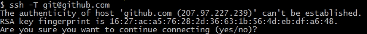    
    该提示是为了让你确认RSA Key的指纹信息是否与本机上的吻合
    
    输入“yes”即可，会跳出关于github.com服务器的连接信息，如果没有出现 `access denied` ，则说明连接正确。

## 语法、常量、变量及数据类型详解

### 基本结构控制语句
if
else
elseif/else if
while
do-while
for
foreach
break
continue
switch
declare
return
require
include
require_once
include_once

## 运算符、流程控制

## 循环结构、系统函数和自定义函数

## 数组、多维数组和数组函数

## 字符串操作变换

## 文件操作函数

# PHP与OOP

## 面向对象的基本概念  

### OOP  

`Object-oriented programming`  

An object-oriented program may be considered a collection of interacting objects.Each object is capable of sending and receiving messages,and processing data.  
指一种程序设计范型，同时也是一种程序开发的方法。对象指的是类的集合。它将对象作为程序的基本单元，将程序和数据封装其中，以提高软件的重用性、灵活性和扩展性。  
面向对象程序设计可以看作一种在程序中包含各种独立而又互相调用的对象的思想，这与传统的思想刚好相反：传统的程序设计主张将程序看作一系列函数的集合，或者直接就是一系列对电脑下达的指令。面向对象程序设计中的每一个对象都应该能够接受数据、处理数据并将数据传达给其它对象，因此它们都可以被看作一个小型的“机器”，即对象。  
目前较为流行的语言中有Java、C#等。随着软件工业的发展，比较早的面向过程的语言在近些年的发展中也纷纷吸收了许多面向对象的概念，比如C->C++，C->Objective-C，BASIC->Visual Basic->Visual Basic .NET  
面向对象程序设计主要思路就是建立一系列类，并定义他们的静态属性和动态行为。简而言之，面向对象思想的精髓包括以下内容  

* 面向对象的系统是由对象构成(object)  
* 把所有的对象都划分成类（class），每个类定义了一组静态的属性和动态的方法。  
* 对象之间通过传递消息（message）互相联系，驱动整 个系统来运转。    
* 类是具有相同相似的结构、操作与约束关系的对象组成的集合。  
* 对象是对某一类的具体化实例，每一个类都是具有某些共同特征对象的抽象。  

### ABSTRACTION  

Abstraction is the practice of reducing and factoring out details so that one can focus on a few concepts at a time.  

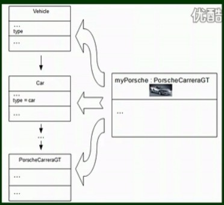

抽象(Abstraction)是简化复杂的现实问题的途径，它可以为具体问题找到最恰当的类定义，并且可以在最恰当的继承级别解释问题。举例说明，莱丝在大多数时候都被当作一条狗，但是如果想要让它做牧羊犬做的事，你完全可以调用牧羊犬的方法。如果狗这个类还有动物的父类，那么你完全可以视莱丝为一个动物。  

### CLASS  

A class defines the characteristics of an object.  
Characteristics include:  
-attributes  
(fields or properties)  
-behaviors  
(methods or operations)  

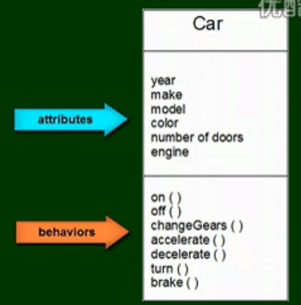

类（Class）定义了一件事物的抽象特点。通常来说，类定义了事物的属性和它可以做到的（它的行为）。举例来说，“狗”这个类会包含狗的一切基础特征，例如它的孕育、毛皮颜色和吠叫的能力。类可以为程序提供模版和结构。一个类的方法和属性被称为“成员”。 我们来看一段伪代码：  
    
    类 狗{  
      私有成员 毛皮颜色;    
      公有成员 吠叫();    
    }  
    
在这串代码中，我们声明了一个类，这个类具有一些狗的基本特征。关于公有成员和私有成员，请参见下面的继承性一节。  

### OBJECT  

An object is an instance of a class.  
Creating an object is alse known as instance.  

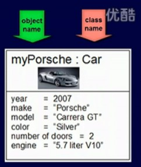

对象（Object）是类的实例。例如，“狗”这个类列举狗的特点，从而使这个类定义了世界上所有的狗。而莱丝这个对象则是一条具体的狗，它的属性也是具体的。狗有皮毛颜色，而莱丝的皮毛颜色是棕白色的。因此，莱丝就是狗这个类的一个实例。一个具体对象属性的值被称作它的“状态”。（系统给对象分配内存空间，而不会给类分配内存空间，这很好理解，类是抽象的系统不可能给抽象的东西分配空间，对象是具体的）  
假设我们已经在上面定义了狗这个类，我们就可以用这个类来定义对象：  
    
    定义莱丝是狗  
    莱丝->毛皮颜色=棕白色;  
    莱丝.吠叫();  
    
我们无法让狗这个类去吠叫，但是我们可以让对象“莱丝”去吠叫，正如狗可以吠叫，但没有具体的狗就无法吠叫。  

类和对象的关系是抽象Abstraction和具体的关系，以学生的例子来说，每一个具体的学生如张三、李四都是一个对象，都是活生生存在的，但世界上并不存在一个叫学生的具体的东西，学生这个概念是所有的张三、李四等具有的共同抽象。  
当然，并非所有类与对象都有现实社会的对应关系，我们在实现系统时，我们可以自已抽象出一个类来，实际上是把一组数据和操做封装一体，然后实例化。如果同学们对数据结构有所了解，可以理解类为抽象的数据类型。  

### Function(Method)  

A method is a behavior of an object.  
Within the program,a method usually affects only one particular object.  

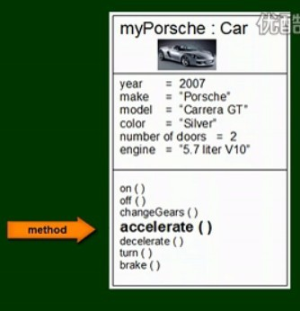  

方法实际就是写在类定义段中的函数。php中，方法指的就是用function来实现的一个写在类中的函数定义。  
WIKI:方法（Method，可看成能力）是定义一个类可以做的，但不一定会去做的事。作为一条狗，莱丝是会叫的，因此“吠叫()”就是它的一个方法。与此同时，它可能还会有其它方法，例如“坐下()”，或者“吃()”。 对一个具体对象的方法进行调用并不影响其它对象，正如所有的狗都会叫，但是你让一条狗叫不代表所有的狗都叫。 如下例：  

    定义莱丝是狗;  
    定义泰尔是狗;  
    莱丝->吠叫();  
    
则泰尔是会叫——但没有吠叫，因为这里的吠叫只是对对象“莱丝”进行的。  

### Message Passing(also known as method calling)  

This is the process where an object sends data to another object or asks the object to invoke a method.   

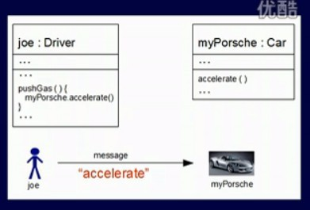

一个对象通过接受消息、处理消息、传出消息或使用其他类的方法来实现一定功能，这叫做消息传递机制（Message Passing）。

### Property  

属性就是指类定义段里的变量。  
类的属性与方法：类的属性是客观世界实体性质的抽像，而方法是实体所能执行的操做。对象相互作用的机制是发送消息，当想让某一对象执行某一个动作时，但向这个对象发送一个消息，告诉其要做什么。对象接收到消息之后，便调用某个方法执行一个动作，这个过程与现实世界的运行方式是一样的。一个消息由三部分组成：  
1. 接收消息的对象：发送给谁  
2. 消息名：需要对象做什么。  
3. 消息参数：需要对象做什么。  
例如，我们可以让我们的学生对象s1长大一岁，则可以对其发送消息s1->长大(1);  

### Inheritance(also known as subclasses)  

A subclass is a specialized version of a class,which inherits attibutes and behaviors from the parent class.  
A subclass can allter its inherited attributes or methods.  
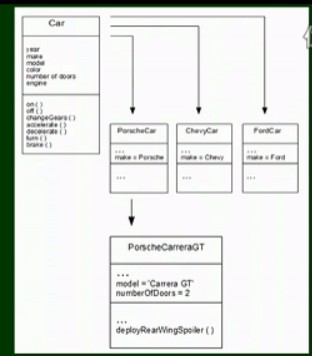

继承性（Inheritance）是指，在某种情况下，一个类会有“子类”。子类比原本的类（称为父类）要更加具体化，例如，“狗”这个类可能会有它的子类“牧羊犬”和“吉娃娃犬”。在这种情况下，“莱丝”可能就是牧羊犬的一个实例。子类会继承父类的属性和行为，并且也可包含它们自己的。我们假设“狗”这个类有一个方法叫做“吠叫()”和一个属性叫做“毛皮颜色”。它的子类（前例中的牧羊犬和吉娃娃犬）会继承这些成员。这意味着程序员只需要将相同的代码写一次。 在伪代码中我们可以这样写：  

    类 牧羊犬 继承 狗{}  

    定义 莱丝是牧羊犬;  
    莱丝->吠叫();    /* 注意这里调用的是狗这个类的吠叫方法。 */  

回到前面的例子，“牧羊犬”这个类可以继承“毛皮颜色”这个属性，并指定其为棕白色。而“吉娃娃犬”则可以继承“吠叫()”这个方法，并指定它的音调高于平常。子类也可以加入新的成员，例如，“吉娃娃犬”这个类可以加入一个方法叫做“颤抖()”。设若用“牧羊犬”这个类定义了一个实例“莱丝”，那么莱丝就不会颤抖，因为这个方法是属于吉娃娃犬的，而非牧羊犬。事实上，我们可以把继承理解为“是”。例如，莱丝“是”牧羊犬，牧羊犬“是”狗。因此，莱丝既得到了牧羊犬的属性，又继承了狗的属性。 我们来看伪代码：  
 
    类 吉娃娃犬 继承 狗{  

    公有成员 颤抖();  
    }  
    类 牧羊犬 继承 狗{}  

    定义 莱丝是牧羊犬;  
    莱丝->颤抖();    /* 错误：颤抖是吉娃娃犬的成员方法。 */  
    
当一个类从多个父类继承时，我们称之为“多重继承”。多重继承并不总是被支持的，因为它很难理解，又很难被好好使用。  

### Encapsulation  

Encapsulation conceals the functional details of a class from objects that send messages to it.  
Encapsulation protects the integrity of an object by preventing users from changing internal data of an object into something invalid.

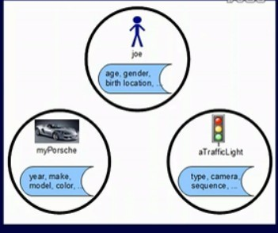

具备封装性（Encapsulation）的面向对象程序设计隐藏了某一方法的具体执行步骤，取而代之的是通过消息传递机制传送消息给它。因此，举例来说，“狗”这个类有“吠叫()”的方法，这一方法定义了狗具体该通过什么方法吠叫。但是，莱丝的朋友蒂米并不需要知道它到底如何吠叫。 从实例来看：  

    /* 一个面向过程的程序会这样写： */
    定义 莱丝;
    莱丝->设置音调(5);
    莱丝->吸气();
    莱丝->吐气();

    /* 而当狗的吠叫被封装到类中，任何人都可以简单地使用： */
    定义 莱丝是狗;
    莱丝->吠叫();
    
封装是通过限制只有特定类的实例可以访问这一特定类的成员，而它们通常利用接口实现消息的传入传出。举个例子，接口能确保幼犬这一特征只能被赋予狗这一类。通常来说，成员会依它们的访问权限被分为3种：公有成员、私有成员以及保护成员。  

### Polymorphism  

Polymorphism is the ability of one type to appear as,and be used like another type.  

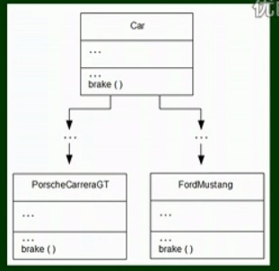

多态（Polymorphism）是指由继承而产生的相关的不同的类，其对象对同一消息会做出不同的响应。举例来说，狗和鸡都有“叫()”这一方法，但是调用狗的“叫()”，狗会吠叫；调用鸡的“叫()”，鸡则会啼叫。 我们将它体现在伪代码上：   

    类 狗{
      公有成员 叫(){
          吠叫();
      }
    }
    类 鸡{
      公有成员 叫(){
          啼叫();
      }
    }

    定义 莱丝是狗;
    定义 鲁斯特是鸡;
    莱丝.叫();
    鲁斯特.叫();

这样，同样是叫，莱丝和鲁斯特做出的反应将大不相同。多态性的概念可以用在运算符重载上，本文不再赘述。  

## 面向对象初始化this关键字  

$this是定义对象中内部保留的变量。它不需要提前定义，当类被实例化为一个对象时，它便存在了。它通过`$this->变量名`的方式来引用内部可见的类的相关属性。  

    类 狗{  
      私有成员 毛皮颜色=“黑色”;    
      公有成员 吠叫();  
      公有成员 显示皮毛的颜色{
        输出 $this->毛皮颜色;
      }
    }

## 初类的封装关键字  

### Visibility  

The visibility of a property or method can be defined by prefixing(前缀) the declaration with the keywords public, protected or private. Class members declared public can be accessed everywhere. Members declared protected can be accessed only within the class itself and by inherited and parent classes. Members declared as private may only be accessed by the class that defines the member.  

    <?php
    /**
    * Define MyClass
    */
    class MyClass{
        public $public = 'Public';
        protected $protected = 'Protected';
        private $private = 'Private';

        function printHello(){
            echo $this->public;
            echo $this->protected;
            echo $this->private;
        }
    }

    $obj = new MyClass();
    echo $obj->public; // Works
    echo $obj->protected; // Fatal Error
    echo $obj->private; // Fatal Error
    $obj->printHello(); // Shows Public, Protected and Private

    /**
    * Define MyClass2
    */
    class MyClass2 extends MyClass
    {
        // We can redeclare the public and protected method, but not private
        protected $protected = 'Protected2';

        function printHello(){
            echo $this->public;
            echo $this->protected;
            echo $this->private;
        }
    }

    $obj2 = new MyClass2();
    echo $obj2->public; // Works
    echo $obj2->private; // Undefined
    echo $obj2->protected; // Fatal Error   
    $obj2->printHello(); // Shows Public, Protected2, Undefined

    ?>

Class methods may be defined as public, private, or protected. Methods declared without any explicit visibility keyword are defined as public.  

### Static Keyword  

Declaring class properties or methods as static makes them accessible without needing an instantiation of the class. A property declared as static can not be accessed with an instantiated class object (though a static method can).  
Static properties cannot be accessed through the object using the arrow operator ->.  
Like any other PHP static variable, static properties may only be initialized using a literal or constant; expressions are not allowed.   

    <?php
    class Foo{
        public static $my_static = 'foo';

        public function staticValue() {
            return self::$my_static;
        }
    }

    class Bar extends Foo{
        public function fooStatic() {
            return parent::$my_static;
        }
    }

    print Foo::$my_static . "\n";

    $foo = new Foo();
    print $foo->staticValue() . "\n";
    print $foo->my_static . "\n";      // Undefined "Property" my_static 
    ?>  

### Scope Resolution Operator (::)  

The Scope Resolution Operator (also called Paamayim Nekudotayim) or in simpler terms, the double colon, is a token that allows access to static, constant, and overridden properties or methods of a class.  

When referencing these items from outside the class definition, use the name of the class.  

    <?php
        class MyClass {
            static CONST_VALUE = 'A constant value';
        }

        $classname = 'MyClass';
        echo $classname::CONST_VALUE; // As of PHP 5.3.0

        echo MyClass::CONST_VALUE;
    ?>

## 类的继承extends  

### Object Inheritance  

Inheritance is a well-established programming principle, and PHP makes use of this principle in its object model. This principle will affect the way many classes and objects relate(有关) to one another.  

For example, when you extend a class, the subclass inherits all of the public and protected methods from the parent class. Unless a class overrides those methods, they will retain their original functionality.  

This is useful for defining and abstracting functionality, and permits the implementation of additional functionality in similar objects without the need to reimplement all of the shared functionality.  

    <?php

    class foo{
        public function printItem($string){
            echo 'Foo: ' . $string . PHP_EOL;
        }
    
        public function printPHP(){
            echo 'PHP is great.' . PHP_EOL;
        }
    }

    class bar extends foo{
        public function printItem($string){
            echo 'Bar: ' . $string . PHP_EOL;
        }
    }

    $foo = new foo();
    $bar = new bar();
    $foo->printItem('baz'); // Output: 'Foo: baz'    
    $foo->printPHP();       // Output: 'PHP is great' 
    $bar->printItem('baz'); // Output: 'Bar: baz'
    $bar->printPHP();       // Output: 'PHP is great'

    ?>

### Constructors and Destructors  

PHP 5 allows developers to declare constructor methods for classes. Classes which have a constructor method call this method on each newly-created object, so it is suitable for any initialization that the object may need before it is used.  
**Note:** Parent constructors are not called implicitly if the child class defines a constructor. In order to run a parent constructor, a call to parent::__construct() within the child constructor is required. If the child does not define a constructor then it may be inherited from the parent class just like a normal class method (if it was not declared as private).  

    <?php
    class BaseClass {
        function __construct() {
        print "In BaseClass constructor\n";
        }
    }

    class SubClass extends BaseClass {
        function __construct() {
        parent::__construct();
        print "In SubClass constructor\n";
        }
    }

    class OtherSubClass extends BaseClass {
        // inherits BaseClass's constructor
    }

    // In BaseClass constructor
    $obj = new BaseClass();

    // In BaseClass constructor
    // In SubClass constructor
    $obj = new SubClass();

    // In BaseClass constructor
    $obj = new OtherSubClass();
    ?>

## 抽象类abstract  

PHP 5 introduces abstract classes and methods. Classes defined as abstract may not be instantiated, and any class that contains at least one abstract method must also be abstract. Methods defined as abstract simply declare the method's signature - they cannot define the implementation.  

When inheriting from an abstract class, all methods marked abstract in the parent's class declaration must be defined by the child; additionally, these methods must be defined with the same (or a less restricted) visibility. For example, if the abstract method is defined as protected, the function implementation must be defined as either protected or public, but not private. Furthermore the signatures of the methods must match, i.e. the type hints and the number of required arguments must be the same. For example, if the child class defines an optional argument, where the abstract method's signature does not, there is no conflict in the signature.   

    <?php
    abstract class AbstractClass{
        // Force Extending class to define this method
        abstract protected function getValue();
        abstract protected function prefixValue($prefix);

        // Common method
        public function printOut() {
            print $this->getValue() . "\n";
        }
    }

    class ConcreteClass1 extends AbstractClass{
        protected function getValue() {
            return "ConcreteClass1";
        }

        public function prefixValue($prefix) {
            return "{$prefix}ConcreteClass1";
        }
    }

    class ConcreteClass2 extends AbstractClass{
        public function getValue() {
            return "ConcreteClass2";
        }

        public function prefixValue($prefix) {
            return "{$prefix}ConcreteClass2";
        }
    }

    $class1 = new ConcreteClass1;
    $class1->printOut();
    echo $class1->prefixValue('FOO_') ."\n";

    $class2 = new ConcreteClass2;
    $class2->printOut();
    echo $class2->prefixValue('FOO_') ."\n";
    ?>
    
    
### Overloading 

Overloading in PHP provides means to dynamically "create" properties and methods. These dynamic entities are processed via magic methods one can establish in a class for various action types.  

The overloading methods are invoked when interacting with properties or methods that have not been declared or are not visible in the current scope. The rest of this section will use the terms "inaccessible properties" and "inaccessible methods" to refer to this combination of declaration and visibility.  

All overloading methods must be defined as public.  

#### Property overloading  

`public void __set ( string $name , mixed $value )`  
`public mixed __get ( string $name )`  
`public bool __isset ( string $name )`  
`public void __unset ( string $name )`  
`__set()` is run when writing data to inaccessible properties.  

`__get()` is utilized for reading data from inaccessible properties.  

`__isset()` is triggered by calling `isset()` or `empty()` on inaccessible properties.  

`__unset()` is invoked when `unset()` is used on inaccessible properties.  

The $name argument is the name of the property being interacted with. The `__set()` method's `$value` argument specifies the value the $name'ed property should be set to.  

Property overloading only works in object context. These magic methods will not be triggered in static context. Therefore these methods should not be declared static. As of PHP 5.3.0, a warning is issued if one of the magic overloading methods is declared static.  

    <?php
    class PropertyTest{
        /**  Location for overloaded data.  */
        private $data = array();

        /**  Overloading not used on declared properties.  */
        public $declared = 1;

        /**  Overloading only used on this when accessed outside the class.  */
        private $hidden = 2;

        public function __set($name, $value){
            echo "Setting '$name' to '$value'\n";
            $this->data[$name] = $value;
        }

        public function __get($name){
            echo "Getting '$name'\n";
            if (array_key_exists($name, $this->data)) {
                return $this->data[$name];
            }

            $trace = debug_backtrace();
            trigger_error(
                'Undefined property via __get(): ' . $name .
                ' in ' . $trace[0]['file'] .
                ' on line ' . $trace[0]['line'],
                E_USER_NOTICE);
                return null;
            }

            /**  As of PHP 5.1.0  */
        public function __isset($name){
            echo "Is '$name' set?\n";
            return isset($this->data[$name]);
        }

        /**  As of PHP 5.1.0  */
        public function __unset($name){
            echo "Unsetting '$name'\n";
            unset($this->data[$name]);
        }

        /**  Not a magic method, just here for example.  */
        public function getHidden(){
            return $this->hidden;
        }
    }

    echo "<pre>\n";

    $obj = new PropertyTest;

    $obj->a = 1;
    echo $obj->a . "\n\n";

    var_dump(isset($obj->a));
    unset($obj->a);
    var_dump(isset($obj->a));
    echo "\n";
    ?>

## mysqli  

The mysqli extension features a dual interface. It supports the procedural and object-oriented programming paradigm.  

Users migrating from the old mysql extension may prefer the procedural interface. The procedural interface is similar to that of the old mysql extension. In many cases, the function names differ only by prefix. Some mysqli functions take a connection handle as their first argument, whereas matching functions in the old mysql interface take it as an optional last argument.  

### The object-oriented interface

The mysqli extension features a dual interface. It supports the procedural and object-oriented programming paradigm.  

Users migrating from the old mysql extension may prefer the procedural interface. The procedural interface is similar to that of the old mysql extension. In many cases, the function names differ only by prefix. Some mysqli functions take a connection handle as their first argument, whereas matching functions in the old mysql interface take it as an optional last argument.  

#### guest  

    table:guests  
    guestid int(11)
    fname varchar(30)
    lname varchar(40)
    comments text

#### mysqli

    $mydb=new mysqli('localhost','dbuser','dbpassword','dbname');

    $sql="SELECT * FROM guests ORDER BY lname,fame";
    $result=$mydb->query($sql);

    while($row=$result->fetch_assoc()){
        echo $row['fname']." ".$row['lname'];
        echo "commit ".substr($row['comment'],0,150);
        echo " ";
    }
    
    $result->close();
    $mydb->close();

    echo $obj->declared . "\n\n";

    echo "Let's experiment with the private property named 'hidden':\n";
    echo "Privates are visible inside the class, so __get() not used...\n";
    echo $obj->getHidden() . "\n";
    echo "Privates not visible outside of class, so __get() is used...\n";
    echo $obj->hidden . "\n";

    
## 常用关键字

## 多态的介绍与优势

## 相关魔术方法

# ThinkPHP与千木服务架构

## MVC初学体验与服务器环境部署

### 如何学习

1. 编程的捷径就是没有捷径
2. 多做代码，多实战，举一反三
3. 学会看手册，学会搜索引擎
4. 尽量开发出自己的一套完整项目
5. 尽量使用到中间的每个功能
6. 同一个效果尽量思考多种方法实现

### MVC

MVC 是一种将应用程序的逻辑层和表现层进行分离的方法。

ThinkPHP 是基于MVC设计模式的。MVC只是一个抽象的概念，并没有明确的规定，ThinkPHP 中的MVC分层大致体现在：

模型（Model）：模型的定义由 Model 类来完成。

控制器（Controller）：应用控制器（核心控制器App类）和Action控制器都承担了控制器的角色，Action 控制器完成业务过程控制，而应用控制器负责调试控制。

视图（View）：由View类和模板文件组成，模板做到了100%的分享，可以独立预览和制作。

但实际上，ThinkPHP并不依赖M或者V，也就是说没有模型或者视图也一样可以工作。甚至也不依赖C，这是因为ThinkPHP在Action之上还有一个总控制器，即App控制器，负责应用的总调试，在没有C的情况下，必然存在视图V，否则就不再是一个完整的应用。

总而言之，ThinkPHP的MVC模式只是提供了一种敏捷开发的手段，而不是拘泥于MVC本身。

MVC框架概念图：
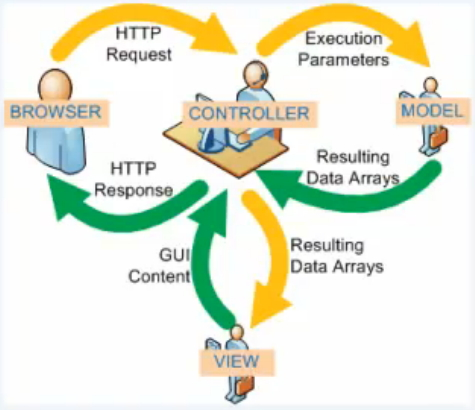

开发原理图：
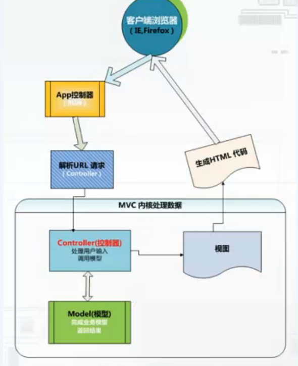

## 目录结构和项目部署

        WebRoot/
            |-ThinkPHP/
            |-Student1/  →每个学员各自项目的仓库内容
                  |-Common/
                  |-Conf/
                  |-Lang/
                  |-Lib/
                     |-Action/
                         |-IndexAction.class.php  ↓培训用的示例控制器系列
                         |-LoginAction.class.php
                     |-Behavior/
                     |-Model/
                     |-Widget/
                  |-Runtime/
                  |-Tpl/
                  |-index.php  →各学员彼此独立入口文件
            |-Student2/
                  |-Common/
                  |-Conf/
                  |-Lang/
                  |-Lib/
                  |-Runtime/
                  |-Tpl/
                  |-index.php
            |-Student3/
                  |-Common/
                  |-Conf/
                  |-Lang/
                  |-Lib/
                  |-Runtime/
                  |-Tpl/
                  |-index.php
            |-StudentN/
                  |-Common/
                  |-Conf/
                  |-Lang/
                  |-Lib/
                  |-Runtime/
                  |-Tpl/
                  |-index.php

## 命名规范和常见参数

类型         |规范
-------------|---------------------------
类名         |`NewClassName`
类文件       |`NewClassName.class.php`
变量名/函数名|`$the_var`/`the_function()`
属性名       |`$this->newProperty`
方法名       |`$this->newMethod()`
常量名       |`CONST_VALUE`

## 系统常量及URL模式

## 开发规范

## 调试工具及空操作

## HTML5快速入门

## 模板引擎

## 服务类拼装

## 表单设计与提交规范

# 千木服务架构高级编程（非正式课程内容）

## 服务类开发

## 数据模型调用
